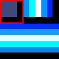
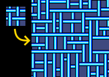
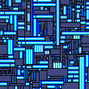
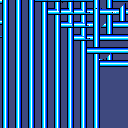

## Table of contents

* [What?](https://github.com/Static-electro/c011apsy#what)
* [Build](https://github.com/Static-electro/c011apsy#build)
* [Basic Usage](https://github.com/Static-electro/c011apsy#basic-usage)
* [Sample](https://github.com/Static-electro/c011apsy#sample)
* [Algorithm Implementation](https://github.com/Static-electro/c011apsy#algorithm-implementation)
* [Usage HIghlights](https://github.com/Static-electro/c011apsy#usage-highlights)


## What?
`c011apsy` (collapsy) is my take on the Wave Function Collapse algorithm (WFC) of pattern generation. The idea behind `c011apsy` was to create a crossplatform header-only library that could be used in just a few lines of code.

## Build

`c011apsy` is a header-only library so it doesn't need to be built. You can just include the header (`include/c011apsy.hpp`) and start using it.
However, the repository includes the cmake file that can be used to integrate the library into an existing project.
If you want to build a sample program, you have several options:
1. If your preferred IDE supports project import from cmake files then use this feature
2. You may also create an empty project in your IDE of choice and just add the header and the source files in it (`include/c011apsy.hpp` and `sample/sample.cpp`)
3. Another option is to use the cmake CLI:
```
.../c011apsy/> mkdir build
.../c011apsy/> cd build
.../c011apsy/build> cmake ../
.../c011apsy/build> cmake --build ./ --config Release
```
4. And of course, it's possible to use the CLI of your preferred compiler. Tell it you need to build `sample/sample.cpp`, that should be enough for it to do all the work

## Basic Usage

```C++
#include <include/c011apsy.hpp>
...
using namespace c011apsy;
Wave<TileType> wave( resultWidth, resultHeight );
...
wave.init( seed, seedWidth, seedHeight, tileWidth, tileHeight, rndSeed );
...
wave.collapse( false );
...
const auto& tiles = wave.getTiles();
const auto& field = wave.getField();

std::vector<TileType> result;
result.reserve( field.size() );

for ( const auto& cell : field )
{
  size_t tileId = cell.first();
  result.push_back( tiles[tileId] );
}
```

### Explanation

To use `c011apsy` no build is needed, just include the header:

```C++
#include <include/c011apsy.hpp>
```

There are two ways of generating a pattern with `c011apsy`: from a seed pattern, or from an existing tileset (see [Usage HIghlights](https://github.com/Static-electro/c011apsy#usage-highlights))

Whichever approach you choose, the start is the same:

```C++
using namespace c011apsy;
Wave<TileType> wave( resultWidth, resultHeight );
```

`TileType` here should be a POD-type instances of which could be compared by `memcmp`. Eventually, each cell of the result will contain an object of this type. Usually, it's either some struct representing a color, or just a tile id that you can substitute for a real object later. `resultWidth` and `resultHeight` represent the output dimensions of the generated pattern.

Now, you need to initialize this wave. If you have a pattern you'd like to use as a seed then use this form:

```C++
wave.init( seed, seedWidth, seedHeight, tileWidth, tileHeight, rndSeed );
```

`seed` is the `std::vector<TileType>`: basically a block of memory where your seed pattern is stored row-by-row. `seedWidth` and `seedHeight` are pretty self-explanatory, they represent the seed dimensions. `tileWidth` and `tileHeight` are a bit tricky, although you can think of them as single tile dimensions. In reality they are more like "local similarity area dimensions", again, see [Usage HIghlights](https://github.com/Static-electro/c011apsy#usage-highlights) for more details. `rndSeed` is an integer value to initialize the random numbers generator. Same `rndSeed` value will produce identical patterns generated across any number of runs. Leave it as default or set it to zero if you want every run to be unique.

If you don't have a seed pattern but a prepared tileset instead, use this initialization form:

```C++
Wave<TileType>::Seed mySeed;
// populate the seed:

// array of tiles
mySeed.tiles = ...

// integer numbers representing each tile's weight.
// Tiles with larger weights are more likely to be placed.
// The size of this vector must be the same as mySeed.tiles
mySeed.weights = ...

// placement rules that tell which tiles could be placed next to each other:
// mySeed.neighbors[i] describes the possible neighbors of mySeed.tiles[i]
// each element of the Neighbor struct has four sets to describe the tile ids
// that are allowed to be placed in the corresponding
// direction (up/down/left/right)
// tile ids here are the indices from the mySeed.tiles array
mySeed.neighbors = ...

// random number generator seed, 0 means random seed
mySeed.rndSeed = ...

wave.init( mySeed );
```

Using some tile id as `TileType` makes the most sense here.

Now you are ready to start the generation! `c011apsy` provides fine-_ish_ control over the generation process. You can either run it all in one go, or step-by-step (see [Algorithm Implementation](https://github.com/Static-electro/c011apsy#algorithm-implementation)). You may also provide a callback, which will be called each time an output cell (e.g. a pixel) is updated. However, keep in mind that a callback is often a *HUGE* performance killer, beware.

```C++;
void callback( const Wave<TileType>& w, size_t x, size_t y );

// using a "one go" approach. In absolute values, it's faster, but cannot be interrupted.
wave.collapse( false, callback );

// using a step-by-step approach, slower, but could be executed ...well... in several steps.
while ( !wave.collapse( true/*, callback*/ ) )
{
    std::cout << "One iteration closer to the solution!" std::endl;
}

// sample callback, let's print out the operation progress here
void callback( const Wave<TileType>& w, size_t x, size_t y )
{    
    std::cout << "Updated cell at " << x << "," << y << std::endl;
    std::cout << "Progress: " << w.getProgress() << "%" << std::endl;
}
```

Sweet! The generation process is complete. How to get the result? Here you go:

```C++
const auto& tiles = wave.getTiles();
const auto& field = wave.getField();

std::vector<TileType> result;
result.reserve( field.size() );

for ( const auto& cell : field )
{
  size_t tileId = cell.first();
  result.push_back( tiles[tileId] );
}
```

`result` now contains the generated pattern of the desired dimensions, stored row-by-row.


## Sample

The sample program included in the repository demonstrates the work of the WFC when initialized by a seed pattern. The program consumes the seed in a form of bitmap (.bmp) file, generates a similar pattern and then stores it as another bitmap file. The typical usage looks like this:

```bash
sample img/pipes.bmp 4 4 generated.bmp 128 128 42
```

Here, sample will load `img/pipes.bmp` as a seed, and then it will generate the 128x128 output using the 4x4 tiles. The last parameter (42) is a random number generator seed, it may be omitted. Result will be saved as `generated.bmp` in the current directory.

> :exclamation: `c011apsy` will need *at least* `min( 8, number_of_tiles / 8 ) * result_area` bytes to process the request, while the `number_of_tiles` generated from a seed pattern may be up to `( seed_width - tile_width + 1 ) * ( seed_height - tile_height + 1 )`. To put this into perspective: 128x128 seed with 32x32 tiles and 1024x1024 result will require more than 1Gb of memory. Please see [Algorithm Implementation](https://github.com/Static-electro/c011apsy#algorithm-implementation) and [Usage HIghlights](https://github.com/Static-electro/c011apsy#usage-highlights) sections to get more details on the restrictions and best practices.


## Algorithm Implementation

There are lots of incredible articles on this topic. I link only a few here:

[Very detailed description](https://sudonull.com/post/1592-Wave-function-collapse-an-algorithm-inspired-by-quantum-mechanics)

[Another good explanation](https://robertheaton.com/2018/12/17/wavefunction-collapse-algorithm/)

These gave me good understanding of the Wave Function Collapse algorithm, and I took them as inspiration. However, I didn't take a look at any code before starting `c011apsy` in hope that my implementation might be a bit different. Did it work out as planned? Idk, maybe? :D

So, the basic idea of the WFC is quite simple: given a tileset and some rules describing which tiles could be neighbors, generate a pattern that conforms to these rules.

It starts from creating the output: a field of MxN cells. Initially, each field cell could contain any tile. Then, the iterative generation process starts:
1. pick a cell that has the lowest number of possible tiles to place, let's call it *C*
2. get its **upper** neighbor, let's call it *Nu*
	1. get allowed bottom (opposite of **upper**) neighbors for each tile that is possible to place in the *Nu* cell
	2. combine all allowed tiles into a single set
3. repeat (2) for left, right, and bottom *C*'s neighbors, you have 4 sets of allowed tiles now
4. intersect all four sets from each neighbor, i.e. create a set that consists only of those tiles that are present in each of four sets
5. intersect the result of (4) with the *C*'s current possible tiles
6. using the tiles weights (tile frequency, etc. or even at random), pick a tile from (5) and assign it to cell *C*
	1. depending on the initial tileset and the rules, it's quite possible that the result of (5) is empty. In this case you may either pick any tile at random, or use the _union_ of the four neighboring sets as a pool for picking a tile
7. mark cell *C* as visited, add its neighbors to the processing queue
8. for each cell in the queue, repeat the process from step (2)
9. repeat the process from step (1) until every field cell is left with only one possible tile to place in (step-by-step generation approach exits here every time)


## Usage Highlights

When you are using `c011apsy` to generate patterns based on an existing seed, it's important to understand how it actually splits a seed into tiles. The WFC does *not* generate patterns by splitting a seed into tile-sized areas on a regular grid. Instead, it uses an input seed pattern to create a set of cell-placing rules. The *tile size* concept here means the "local similarity area", i.e. any area of that size from a generated pattern could
 be found inside a seed (and *NOT* the other way around). Here, you can see how the 10x10 pixel seed is split into such areas (4x4 pixels each):
 

 
The example of a generation is shown below. Here the seed is 32x32 pixels, and the tile size is 5x5. So, if you take any region of 5x5 pixles from the result, you should be able to find it inside the seed pattern:
 


The tile size parameter has a huge impact on the character of the generated result. On the illustrations below, the seed is the same, but the tile size is changed:

2x2 tiles: 


8x8 tiles: 


In general, the tile size of 3x3 is usually the smallest one where some of the initial seed structure could be recognized. The bigger the tile size the harder it is for the algorithm to generate an error-free pattern, up to the point where it just takes
 a whole seed and puts it in the result repeatedly. The best seed patterns are usually the ones that have _enough_ self-repetition on a scale of a given tile size. I recommend to play with the couple .bmp images from the `img/` directory of the repository
 to get a basic idea. Keep in mind that WFC operates on combination possibilities, so don't try to use a huge seed with a big tile size. Most likely, this will lead to a combinatoric explosion and the generation process will require a lot more memory than
 you have available :D

In my experince, the seed-based generation is more useful for artistic patterns, using a color as `TileType`. For anything more meaningful (i.e. videogame levels) the manually prepared rules, although cumbersome, seem to give more control over the result. In this case you may just treat each cell (pixel) of
the result as some object, so the result represents a map of some sort. In this case, `TileType` will represent objects ids, and the tile size will basically define the distance of the tile-placing rules influence. Keep in mind, that although `c011apsy` itself does not have any additional rules for tile placing (i.e. mandatory tiles, border tiles, etc.) it should be easy to workaround: it's possible
 to make changes in the field state after the wave initialization, before the generation has started (use `Wave::getField()`). Say, you may put a specific tile alongside all the borders (it might be a good idea 
 to call `Wave::collapseStep()` for cells altered in this way). Then the algrorithm will try to accomodate those in a generation step.
 

